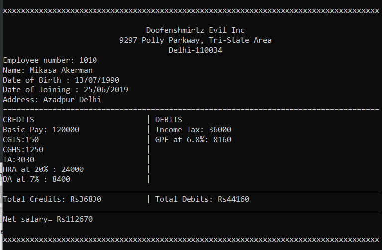

# Employee Management System
A user-friendly **C++** application for managing database in a corporate firm using concepts of **OOPS** and **File Handling** . Application allows **CRUD** operations for employee details and stores them in a binary file resulting in permanent data storage. Developed application generates the pay slip of an employee while accounting for *DAA*, *HRA*, *Transport Allowance* and other salary components.

## Process Description
In this program an extensive use of files system of C++. There are different functions for:  
-	Creation of binary file and storing employee records in it
-	Insertion of record of new employee while maintaining the sort order.
-	Modification of record of a preexisting employee
-	Deletion of record of a preexisting employee
-	Modification of Rates
-	Generation of Pay-slips of an employee

## Classes Used
### 1. Employee
The data members of the class are private and the member functions are public.  
**Data Members:**  

| Member Name | Return Type | Significance        |
|-------------|-------------|---------------------|
| empnum      | int         | Employee Number     |
| fname[50]   | char        | First Name          |
| lname[50]   | char        | Last Name           |
| dob[11]     | char        | Date of Birth       |
| doj[11]     | char        | Date of Joining     |
| addr1[20]   | char        | City Name           |
| addr2[20]   | char        | State Name          |
| BP          | float       | Basic Pay           |
| TA          | float       | Transport Allowance |
| CGIS        | float       | CHIS value          |
| CGHS        | float       | CGHS value          |

**Member Functions:**

| Function Name  | Return Type | Functionality                        |
|----------------|-------------|--------------------------------------|
| getdata()      | void        | Receives the Information of Employee |
| putdata()      | void        | Displays the Information of Employee |
| reteno()       | int         | Returns the Employee Number          |

### 2. Rates
The data members of the class are private and the member functions are public.  
**Data Members:**  

| Member Name  | Return Type | Significance                          |  
|--------------|-------------|---------------------------------------|   
| DAr          | float       | Rate at which DA is to be calculated  |   
| HRAr         | float       | Rate at which HRA is to be calculated |  
| GPFr         | float       | Rate at which GPF is to be calculated |

**Member Functions:**

| Function Name  | Return Type | Functionality                            |
|----------------|-------------|------------------------------------------|
| getRate()      | void        | Allows the user to enter different Rates |
| putRate()      | void        | Displays the values of different Rates   |
| retDAr()       | float       | Returns DAr                              |
| retHRAr()      | float       | Returns HRAr                             |
| retGPFr()      | float       | Returns GPFr                             |

## Binary files
### 1. Employee.dat
Used to store the information of employee objects.  
**Content:**

| Employee Id | Name                        | Birth Date        | Joining Date      | Address                   | Basis Pay     | TA          | CGIS       | CGHS        |
|-------------|-----------------------------|-------------------|-------------------|---------------------------|---------------|-------------|------------|-------------|
|     1001    |     Ashwani Roy             |     27/05/1990    |     05/05/2017    |     Parmanand,   Delhi    |     75620     |     1500    |     145    |     1200    |
|     1002    |     Bhaskar      Chaudry    |     18/02/1992    |     25/06/2015    |     Timarpur,   Delhi     |     80282     |     2300    |     147    |     196     |
|     1003    |     Raj Khurana             |     19/08/1992    |     27/04/2015    |     Mohali,   Delhi       |     125000    |     9750    |     103    |     1200    |
|     1005    |     Light Yagami            |     03/11/1996    |     24/06/2020    |     Dhaka,   Delhi        |     80808     |     6500    |     190    |     800     |
|     1006    |     Eren Yaegar             |     14/07/1997    |     14/06/2019    |     Parmanand,   Delhi    |     75000     |     4500    |     160    |     620     |
|     1009    |     Rajesh Kapoor           |     05/05/1995    |     13/07/2016    |     Burari,   Delhi       |     62000     |     9000    |     250    |     1250    |
|     1010    |     Mikasa Akerman          |     13/07/1990    |     25/06/2019    |     Azadpur,   Delhi      |     120000    |     3030    |     150    |     1250    |
|     1013    |     Armin Arlet             |     12/04/1994    |     25/06/2018    |     Mohali,   Delhi       |     90051     |     3698    |     160    |     900     |
|     1014    |     Naruto Uzumaki          |     08/08/1989    |     14/06/2018    |     Parmanand,   Delhi    |     74600     |     6000    |     140    |     1014    |
|     1015    |     Sheldon Cooper          |     25/06/1992    |     13/07/2016    |     Azadpur,   Delhi      |     71200     |     3500    |     100    |     700     |

### 2. Rate.dat
Used to store the rates of entities like DA, HRA etc.   
**Content:**

| Entity Name  | Value |
|--------------|-------|
| DAr          | 7%    |
| HRAr         | 20%   |
| GPFr         | 6.8%  |

## Sample Output

## Current Limitations
-	The alignment of the final output may vary for different values of basic pay, HRA etc.
-	The program is also limited by the limitations of the library functions it uses. For example, inputting a character when a number is expected can cause unexpected behaviour.
-	While modifying the details of an Employee the user might enter incorrect Employee number which disturbs the sort order.
